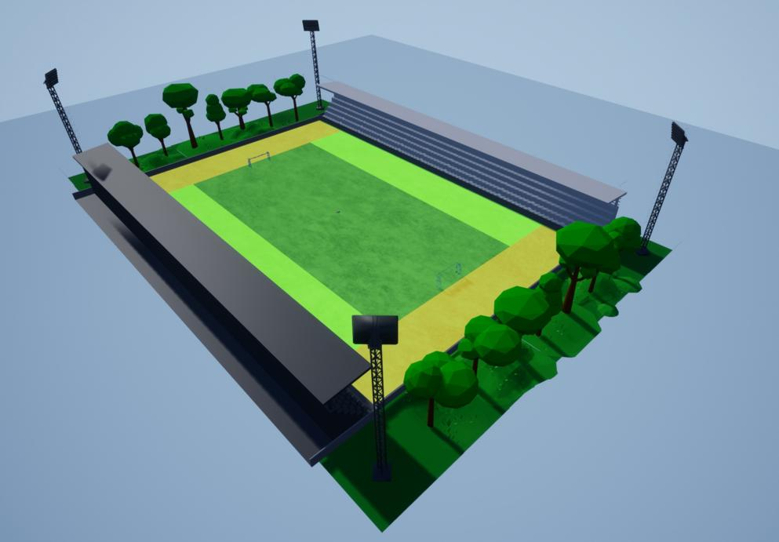
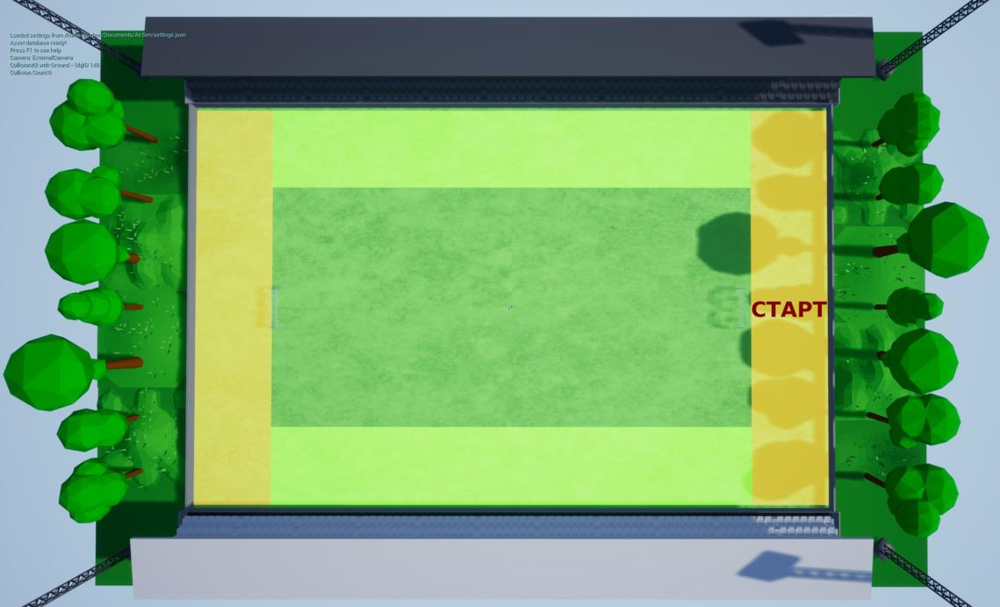
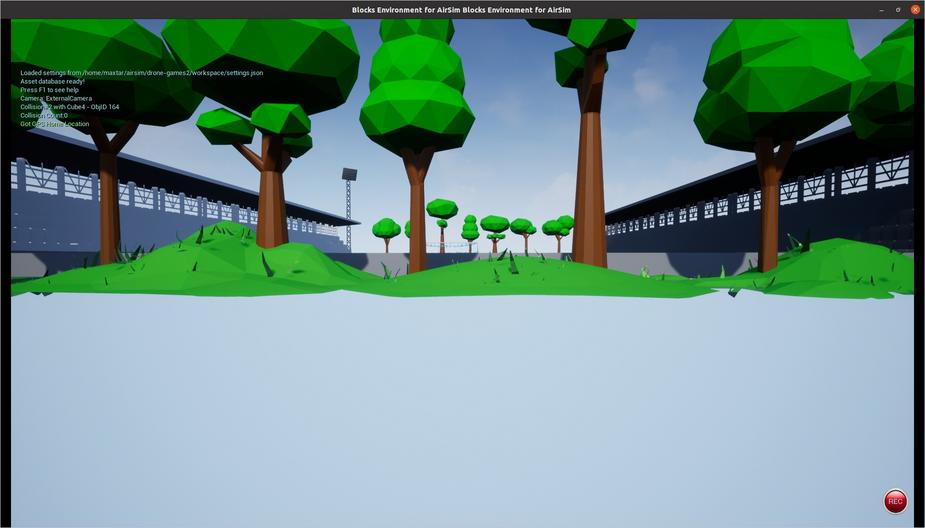

Синхронный полет (тестовое задание)
================

### Описание дисциплины

В рамках дисциплины «Синхронный полет» задача Команды разработать и запрограммировать алгоритм, позволяющий группе беспилотных аппаратов преодолеть гоночную трассу, выстраиваясь перед трибунами зрителей в геометрические формации различной сложности.

[Общая информация](INFO.md)

### Гоночная трасса

Гоночная трасса представляет собой спортивный стадион.



Полет группы аппаратов осуществляется над беговыми дорожками по направлению против часовой стрелки. Место старта находится за правыми футбольными воротами.



Зоны пролета - части беговых дорожек, отмеченные зеленым цветом.

Над зонами пролета группа аппаратов должна двигаться поддерживая формацию (взаимное пространственное расположение) в соответствии с полученным заданием.

Размеры зон пролета: длина 124 метров, ширина 20 метров, высота 50 метров.

Зоны перестроения - части беговых дорожек, отмеченные желтым цветом.

Пролетая над зонами перестроения группа аппаратов должна перестроится в новую формацию в соответствии с полученным заданием.

Размеры зон перестроения: длина 102 метра, ширина 20 метров, высота 50 метров.

Центры зон пролета расположены по следующим координатам: (41; 0) и (-41; 0), зон перестроения: (0; 72) и (0; -72).

### Формации

Формации задаются в относительных координатах (базис системы координат - "Вправо-Вперед-Вверх", где Вперед - по ходу движения, а точка отсчета произвольна), например, построение в виде буквы «Т» из шести аппаратов будет задано в таком виде: (0, -3, 11), (0, -1, 11), (0, 1, 11), (0, 3, 11), (0, 0, 8), (0, 0, 5).

### Запуск

Команда для запуска Симулятора выглядит следующим образом

```
./formation.sh РЕЖИМ_ЛИГИ КОЛ_ВО
```

где РЕЖИМ_ЛИГИ может быть nonprof для Любительской лиги или prof для Профессиональной,
КОЛ_ВО - общее количество аппаратов (по умолчанию 6).

Пример запуска в режиме Любительской лиги с шестью аппаратами

```
./formation.sh nonprof
```

В тестовом задании группа беспилотных аппаратов состоит из одинаковых аппаратов в количестве 6 штук.

После успешного выполнения скрипта вы должны увидеть следующее:



### Задание

Задача Команды разработать алгоритм управления группой аппаратов, который автоматически:

* распределит месторасположение аппаратов в каждой из формаций;
* выдаст управляющие воздействия на аппараты для поддержания формаций;
* выдаст управляющие воздействия на аппараты для перестроения между формациями;
* выдаст управляющие воздействия на аппараты для перемещения по гоночной трассе для выполнения полного полетного задания.


#### Для Любительской лиги:

Полное полетное задание в виде последовательности и набора необходимых для выполнения формаций известно заранее и находится в папке `formation`:

* в файле `borders.txt` хранятся координаты границ зон в виде двух точек, являющихся концами отрезка,
* в папке `test_fs` хранятся текстовые файлы с относительными координатами формаций.

В каждой зоне пролета (до выхода из нее) должна поддерживаться одна формация согласно полученному полетному заданию. После чего в зоне перестроения должно быть выполнено перестроение в следующую по полетному заданию формацию и ее поддержание в ближайшей зоне пролета по направлению движения (показано стрелками). Для тестового задания формаций четыре:

* первая формация - буква Т: (0, -3, 11), (0, -1, 11), (0, 1, 11), (0, 3, 11), (0, 0, 8), (0, 0, 5)
* вторая - Е: (0, 0, 11), (0, 3, 11), (0, 0, 8), (0, 3, 8), (0, 0, 5), (0, 3, 5)
* третья - С: (0, 1, 9), (0, 0, 11), (0, -2, 9), (0, -2, 7), (0, 0, 5), (0, 1, 6)
* четвертая - снова "Т"

#### Для Профессиональной лиги:

При запуске Симулятора автоматически выдается полетное задание в виде необходимой для выполнения формаций в ближайшей зоне пролета по направлению движения (показано стрелками). В тот момент, когда один из аппаратов переходит из зоны пролета в зону перестроения (красные линии), публикуется следующая необходимая для выполнения формаций в ближайшей зоне пролета по направлению движения.

При запуске скрипта `./formation.sh prof` также запускается ROS-нода, публикующая в ROS-топик `/formations_generator/formation` текущие относительные координаты для построения формации в формате `std_msgs.msg.String`:

```
НОМЕР_СООБЩЕНИЯ НАЗВАНИЕ_ФОРМАЦИИ КООРДИНАТА_X_1 КООРДИНАТА_Y_1 КООРДИНАТА_Z_1 КООРДИНАТА_X_2 КООРДИНАТА_Y_2 КООРДИНАТА_Z_2 ...
```

Если формаций для публикации больше не осталось и один из аппаратов выходит из зоны пролета (пересекает финишную границу), то публикуется строка со спец. символом `|` вместо названия:

```
НОМЕР_СООБЩЕНИЯ |
```

Координаты текущей требуемой формации публикуются в вышеназванный ROS-топик. В тот момент, когда один из аппаратов переходит из зоны пролета в зону перестроения, начинают публиковаться новые относительные координаты.

### Определение отобранных команд

Команды, которые успешно смогут выполнить и загрузить тестовое задние до 23:59 23 ноября проходят в отбор в финальную часть соревнований.

### Загрузка решения

Решения тестовых заданий необходимо отправлять через форму https://forms.gle/RsRcncF4uQpXgAtVA (требуется учетная запись пользователя Google).

