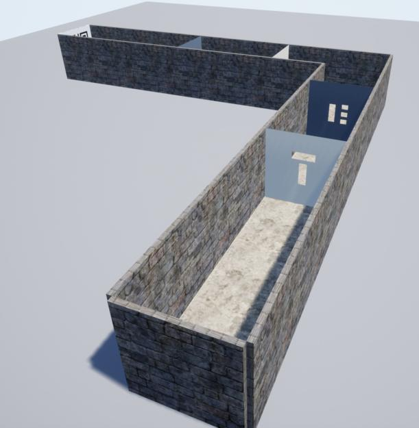
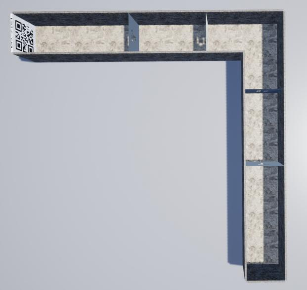
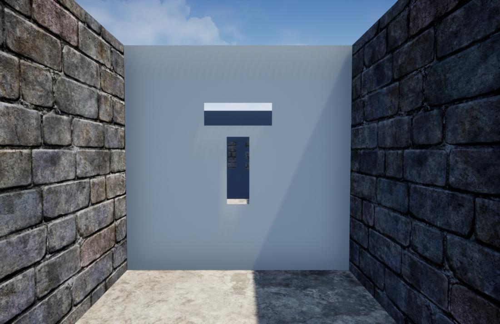
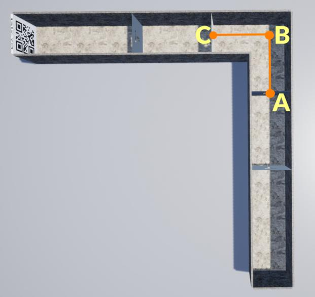

Командная гонка (тестовое задание)
==================================

### Описание дисциплины

В рамках дисциплины «Командная гонка» задача Команды разработать и продемонстрировать работоспособность алгоритма, позволяющего группе беспилотных аппаратов преодолеть многосекционный лабиринт, разделенный перегородками с отверстиями, с использованием технического зрения.

[Общая информация](INFO.md)

### Гоночная трасса

Гоночная трасса представляет собой многосекционный лабиринт, разделенный перегородками с отверстиями.



Полет группы аппаратов осуществляется по лабиринту начиная со взлетной площадки до посадочной площадки (стена примыкающая площадке по ходу движения отмечена QR-кодом).



Поперечные размеры лабиринта 20 на 20 метров, длина и конфигурация лабиринта зависит от количества перегородок и заранее не известна.

Перегородки в лабиринте содержат разноформатные сквозные отверстия через которые необходимо пролетать перестраивая группу аппаратов. На примере изображена перегородка с отверстиями в виде стилизованной буквы Т. Количество и конфигурация отверстий в перегородке заранее не известно.



Отверстия в перегородках участникам не выдаются и одна из задач - самостоятельно определять отверстия по камерам, установленным на аппарате.

Перегородки могут содержать отверстия, в которые отдельно взятый аппарат не может пролететь из-за габаритных ограничений, поэтому в алгоритме управления необходимо будет делать проверку для исключения таких отверстий из маршрута полета группы.

Минимальное расстояние между перегородками 40 метров.

Стены, пол и потолок лабиринта являются непроходимой преградой для аппаратов и на них работает механизм упругого столкновения.

### Центральная линия

Для передачи конфигурации лабиринта между перегородками используется механизм центральных линий. Центральная линия – это виртуальная линия, длины перпендикуляров от которой к стенам, полу и потолку лабиринта равны.

Центральная линия задается строкой, содержащей координаты произвольного количества точек, разделенных пробелами:

```
x1 y1 z1 x2 y2 z2 ... xN yN zN
```

Точки задают отрезки, из которых составлена центральная линия. Каждая центральная линия последним отрезком упирается в стену с отверстиями и перпендикулярна ей, последняя центральная линия упирается в глухую стену.

Например, заданная следующей строкой центральная линия: `90 0 10 120 0 10 120 30 10` состоит из трех опорных точек в локальной системе координат Симулятора с координатами A (90; 0; 10), B (120; 0; 10) и C (120; 30; 10). В крайних точках (A и C) расположены центры перегородок.



### Формации

Какой вид и пространственную конфигурацию формации использовать для прохождения каждой из перегородок должно рассчитываться в алгоритме управления группой, исходя из анализа расположения отверстий в перегородках между секциями лабиринта.

### Запуск

Команда для запуска Симулятора выглядит следующим образом

```
./race.sh РЕЖИМ_ЛИГИ КОЛ_ВО
```

где РЕЖИМ_ЛИГИ может быть prof для Профессиональной или exp для Экспертной лиги,
КОЛ_ВО - общее количество аппаратов (по умолчанию 3).

Пример запуска в режиме Профессиональной лиги

```
./race.sh prof
```

В тестовом задании группа беспилотных аппаратов состоит из одинаковых аппаратов в количестве 3 штук.

После успешного выполнения скрипта вы должны увидеть следующее:


### Задание

Задача Команды разработать алгоритм управления группой аппаратов, который автоматически:

* обнаружит отверстия в перегородках между секциями лабиринта;
* проанализирует расположение отверстий;
* распределит месторасположение аппаратов в каждой из формаций для оптимального пролета через отверстия в каждой из перегородок;
* выдаст управляющие воздействия на аппараты для поддержания формаций;
* выдаст управляющие воздействия на аппараты для перестроения между формациями;
* выдаст управляющие воздействия на аппараты для перемещения по гоночной трассе с площадки взлета до посадочной площадки преодолевая перегородки.

Задача группы аппаратов преодолеть лабиринт начиная с площадки взлета и до посадочной площадки, пролетая сквозь отверстия в перегородках за счет перестроения в разные формации.

#### Для Профессиональной лиги:

При запуске Симулятора автоматически выдается полетное задание в виде центральной линии. Как только любой из аппаратов группы пролетает сквозь перегородку, происходит выдача следующей центральной линии.

Топики:

* `/path_generator/central`

Формат строки топиков: значения разделены пробелами

```
central: НОМЕР_СООБЩЕНИЯ НОМЕР_ЛИНИИ x1 y1 z1 x2 y2 z2 ... xN yN zN
```

Если центральная линия последняя, в central вместо имени используется символ `|`.

#### Для Экспертной лиги:

Участникам Экспертной лиги необходимо используя камеры, установленные на аппарате, самостоятельно определять не только отверстия, но и маршрут, без использования центральных линий.

### Определение отобранных команд

Команды, которые успешно смогут выполнить тестовое задние до 22 ноября (включительно) проходят в финальную часть соревнований.


